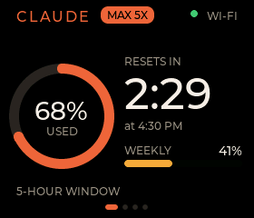
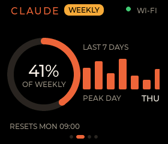
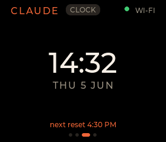
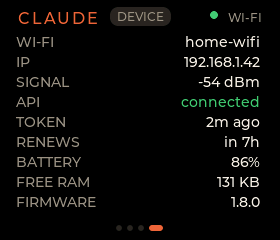
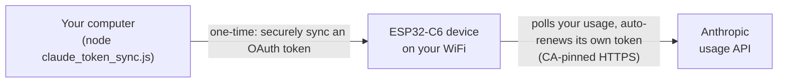

# ESP32-C6 Claude Monitor

A small desk monitor for your Claude usage, running on a **Waveshare ESP32-C6-Touch-LCD-1.69**. It shows your
5-hour and weekly limits with live reset countdowns, a clock and device status, on swipeable LVGL screens.

Usage comes straight from Anthropic: the device calls the usage API directly over CA-pinned HTTPS and refreshes
its own OAuth token on the device. No proxy, no Docker, no Pi. Just the device on your WiFi.

## Screenshots
Swipe between four screens (rendered from the desktop simulator):

| Session | Weekly | Clock | Device |
|:---:|:---:|:---:|:---:|
|  |  |  |  |

## Features
- **Live usage** straight from Anthropic: your 5-hour session and weekly limits, with live reset countdowns.
- **Plan tier** badge (Max 5x, Max 20x or Pro), read from your token.
- **Four screens** you swipe between: Session, Weekly, Clock and Device.
- **On-device OAuth** that refreshes its own rotating token, with no proxy or server in between.
- **Honest display** that blanks to `--` when offline rather than showing stale or made-up numbers.
- **Idle sleep**: a small Claude bot dozes on the clock when no session is active.
- **Shake to summon**: give the device a shake and a friendly Claude bot pops up, blinks and beeps.
- **Audio alerts**: soft chimes when you cross a usage threshold.
- **"Needs input" alerts**: a Claude Code hook lights the screen when a session is waiting on you. [Set it up](docs/claude-code-hooks/README.md).
- **Updates** over WiFi (OTA) or USB, plus live settings over the LAN with no reflash.

Runtime settings, the web API and the desktop simulator are documented in the [wiki][wiki].

## How it works
You log in once on your own machine and run a single script. It securely syncs an OAuth token to the device,
and from then on the device looks after itself: it polls Anthropic for your usage and renews its own token
automatically. There is no proxy, no server and no cloud relay. Everything is self-contained on your WiFi.



The token script logs in to a dedicated config directory, so the device gets its own token family and renewing
it never logs you out. See [ADR-0006](adr/0006-device-direct-oauth.md) for why the device talks to Anthropic
directly rather than through a proxy.

## Getting started
You need [PlatformIO](https://platformio.org/), [Node.js](https://nodejs.org/) (for the token script) and a
USB-C **data** cable.

1. **Configure.** Copy the template and fill in your WiFi and a device token you choose:
   ```bash
   cp config.example.json config.json
   ```
   `config.json` is gitignored, so your secrets stay local. Leave the `oauth` block alone; the token script
   fills it in.

2. **Build and flash over USB.** The first build downloads the toolchain and libraries (slow, one-off); later
   builds are incremental.
   ```powershell
   pio run -d firmware -t upload
   ```
   If you see `Could not open COMx`, replug the cable (the C6's native USB drifts after a reset) and retry.

3. **Sync your token.** Install [Claude Code](https://claude.com/claude-code), then run:
   ```bash
   node claude_token_sync.js
   ```

That is it. The device boots to the clock, joins your WiFi, and slides to your live usage once the token lands.
After the first USB flash you can update wirelessly over OTA; the [wiki][wiki] covers OTA and rollback.

**Hardware:** Waveshare ESP32-C6-Touch-LCD-1.69. The pinout, quirks and the portable multi-board design live in
[`docs/multi-board-architecture.md`](docs/multi-board-architecture.md) and the
[board spec](boards/esp32c6/esp32-c6-touch-lcd-1.69/SPEC.md).

## How we use Claude Code
This project is built with [Claude Code](https://claude.com/claude-code), and the workflow lives in the repo so
it travels with the code:
- [`CLAUDE.md`](CLAUDE.md): the developer guide, with the build and flash recipes, the issue-driven workflow and
  the conventions every change follows.
- [`.claude/rules/`](.claude/rules): folder-scoped rules that load automatically when you edit `firmware/` or
  `ui/` (hardware constraints, the portable-UI boundary, the release checklist).
- [`.claude/skills/orient`](.claude/skills/orient): an "understand before you change" skill that maps a
  subsystem before any edit.
- [`.claude/hooks/`](.claude/hooks): a `SessionStart` hook that flags release and documentation drift.

## Secrets
All secrets live in one gitignored file. Copy the template and fill it in:

| Copy this | to (gitignored) | Holds |
|---|---|---|
| `config.example.json` | `config.json` | WiFi SSID and password, the device token, device settings |

The `oauth` tokens are written by the sync script, never by hand. The device build reads `config.json` through a
pre-build script into compile-time defines. Before pushing, check that nothing secret is tracked; see
[`CLAUDE.md`](CLAUDE.md) for the one-line check.

## Repo layout
| Path | What |
|---|---|
| `ui/` | Portable LVGL UI, shared by the firmware and the simulator. Edit screens here. |
| `firmware/` | Device PlatformIO project (`src/` glue, `include/` config, `releases/` known-good builds). |
| `experiments/sim/` | Desktop simulator that renders the UI to PNG, no hardware needed. |
| `boards/` | Per-device hardware specs (one folder per board, so more boards can be added). |
| `claude_token_sync.js` | One-shot setup script that logs in and pushes an OAuth token to the device. |
| `adr/` | Architecture Decision Records, the *why* behind key choices. |
| `docs/` | Architecture, hardware reference and the schematic. |
| `CLAUDE.md` | Developer workflow and flashing recipes. |

## More
[Architecture](docs/ARCHITECTURE.md) · [decisions](adr/README.md) · [board spec](boards/esp32c6/esp32-c6-touch-lcd-1.69/SPEC.md) · [roadmap](https://github.com/potgieterdl/esp32-claude-mon/issues) · [wiki][wiki] · [developer guide](CLAUDE.md)

[wiki]: https://github.com/potgieterdl/esp32-claude-mon/wiki
