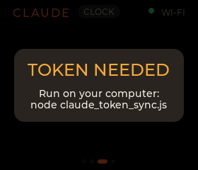
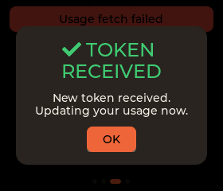

# ESP32-C6 Claude Monitor

A desk monitor for Claude usage on a **Waveshare ESP32-C6-Touch-LCD-1.69**. Shows your Claude
subscription limits (5-hour + weekly windows with live reset countdowns), a clock, and device
status on swipeable LVGL screens — with soft audio alerts, runtime settings, and WiFi/USB updates.

Usage data comes **straight from Anthropic** — the device calls `api.anthropic.com/api/oauth/usage`
directly over CA-pinned HTTPS and refreshes its own OAuth token on-device (via `platform.claude.com`).
No proxy, no Docker, no Pi — just the device on your WiFi.

## Screenshots
Swipe between four screens (rendered from the desktop simulator):

| Session | Weekly | Clock | Device |
|:---:|:---:|:---:|:---:|
|  |  |  |  |
| 5-hour ring + countdown | 7-day window + bars | time/date + next reset | wifi/api/token/battery |

First-time setup prompts on the device, and confirms when the token syncs:

| Setup prompt | Token synced |
|:---:|:---:|
|  |  |

## Features
- **Live Claude usage** — 5-hour and weekly limit rings with live reset countdowns, pulled directly from Anthropic.
- **Plan badge** — shows your real subscription tier (Max 5x / Max 20x / Pro), read from the token's `rate_limit_tier`.
- **Swipeable screens** — **Session** (5h ring + countdown + weekly bar) · **Weekly** (ring + 7-day bars) ·
  **Clock** (time/date + next reset) · **Device** (wifi/ip/api/token/battery/heap/firmware). Boots to the clock,
  then slides to Session once connected.
- **On-device OAuth** — calls Anthropic directly over TLS verified against bundled root CAs, and **refreshes its
  own token** (rotating refresh token persisted to LittleFS) — no server in the middle.
- **Honest display** — keeps the last reading through brief WiFi blips, blanks to `--` when truly offline
  (never fake numbers), the ring **drains to zero** when a usage window resets, and the countdown shows
  **"No current session"** when no 5-hour window is active (instead of a stuck `0:00`).
- **WiFi** — auto-(re)connects in the background to reach Anthropic; survives drops without nuking the screen.
- **Smooth UI on a single core** — fluid swipes/animations via **LovyanGFX async-DMA + double buffering at
  80 MHz SPI**, getting the most out of the single-core ESP32-C6.
- **One-file config** — WiFi, device token, alert thresholds, timezone, brightness and dim-on-idle all in
  `config.json`; tweak the device's settings live over the LAN, no reflash.
- **Audio alerts** — soft chimes at usage thresholds (ES8311 codec).
- **Real clock** — NTP + on-board RTC, timezone-aware, with live reset countdowns.
- **Wireless + USB updates** — flash over WiFi (OTA) or cable.
- **Desktop simulator** — preview the UI as PNGs with no hardware.
- **On-device diagnostics** — a serial health line over USB (reset reason, heap, RSSI, WiFi drops, I2C scan)
  for debugging during development; silent and non-blocking when running headless.

## Hardware
**Waveshare ESP32-C6-Touch-LCD-1.69** — ESP32-C6 (RISC-V, WiFi 6 / BLE) · 1.69″ ST7789V2 240×280 IPS ·
CST816T touch · ES8311 audio · PCF85063 RTC. Canonical pinout, quirks & flashing →
[`boards/esp32c6/esp32-c6-touch-lcd-1.69/SPEC.md`](boards/esp32c6/esp32-c6-touch-lcd-1.69/SPEC.md).
The repo is structured so [more boards](boards/README.md) can be added (portable UI + per-device adapter).

## First-time setup
**One config file for everything:** `cp config.example.json config.json` and fill it in (WiFi, a `device`
token, device settings). It's gitignored, so your secrets never get committed. The `oauth` block is written
for you by the token-sync script (below) — don't hand-edit it.
1. **Config** — copy + fill `config.json` (above).
2. **Flash** — build + flash the device over USB (first time), then OTA over WiFi after that.
3. **Token** — install Claude Code, then run `node claude_token_sync.js` to log in and push an OAuth token
   to the device (*Token setup* below).

### Token setup
The device needs an OAuth token to call Anthropic. `claude_token_sync.js` (repo root) runs `claude auth login`
into a **dedicated** config dir (`~/.claude-device`) so the device gets its **own** token family —
independent of your everyday Claude Code login, so the device refreshing its token never logs *you* out.
It then PUTs the token to the device.
```bash
node claude_token_sync.js                 # logs in (dedicated dir), syncs to claude-monitor.local
node claude_token_sync.js --device <ip>   # if mDNS isn't available, target the IP directly
```
The device auto-refreshes the token from then on (rotating refresh token, persisted to LittleFS); re-run the
script only if the token family is ever revoked.

## Build & flash
Needs [PlatformIO](https://platformio.org/). Uses the **pioarduino** platform fork (required for ESP32-C6).
The first build downloads the toolchain + libraries from the PlatformIO registry (slow, one-time); later
source-only builds are incremental. **No manual library setup** — `docs/demo/` and `vendor/` are optional
Waveshare reference material (gitignored), not needed to build.

**Over USB**
```powershell
$env:PYTHONIOENCODING='utf-8'        # avoid a cosmetic Windows console error
pio run -d firmware -t upload         # build + flash (auto-detects COM port)
```
If you hit **`Could not open COMx`**, replug the USB-C cable (the C6's native USB port drifts after
resets) and retry. If it keeps fighting you, use OTA instead ↓.

**Over WiFi (OTA)** — no cable; the recommended path once the device is on the network.
Build first, then upload `firmware/.pio/build/esp32-c6/firmware.bin` (the app image, **not** the
`*.factory.bin`) to **`http://<device-ip>/update`** in a browser (user `admin`, pass = the `device` token).
OTA writes the *inactive* app slot and only boots it if the MD5 checks out, so a bad upload can't
brick the device. To script it with `curl`, see [`CLAUDE.md`](CLAUDE.md) → *Flash over WiFi (OTA)*.

**Rollback:** flash a known-good image from `firmware/releases/` — see
[`firmware/releases/README.md`](firmware/releases/README.md). **Always bump `FW_VERSION`** in
`firmware/include/app_config.h` before a build (shows on the Device screen + `/` page; matches the git tag).

> **Render path:** **LovyanGFX** (async GDMA SPI @ 80 MHz, double partial buffers) + **LVGL v9** —
> *not* TFT_eSPI / Arduino_GFX (incompatible or slower on the single-core C6).

## Live device settings (`/config.json` endpoint)
Beyond the root `config.json` you edit at setup, the **device** also serves its *live* settings on the LAN —
change brightness, thresholds, etc. **without reflashing**. (The device seeds these from the build-time
defaults baked in from your root `config.json`'s `device` section.) Auth: basic `admin` / the `device` token.
```bash
curl -u admin:$TOKEN http://claude-monitor.local/config.json                 # read current settings (mDNS)
curl -u admin:$TOKEN -X PUT -H "Content-Type: application/json" \
     -d '{"display":{"brightness":30,"dim_on_idle":true,"dim_after_s":60}}' \
     http://claude-monitor.local/config.json                                 # merge + persist
```
Configurable: **WiFi**, **poll_seconds**, alert **thresholds** (warn/max %), **timezone** (POSIX TZ),
and **display** (brightness, dim-on-idle + timeout). Brightness applies live; others on next use.
A bad value is clamped; a malformed body returns `400` and never overwrites the file. (The `oauth` block
also lives here but is managed by the device + sync script, not hand-edited.)

## Web endpoints (port 80)
The device is reachable by mDNS as **`claude-monitor.local`** (or its DHCP IP).
| Path | Auth | Purpose |
|---|---|---|
| `/` | none | status page — firmware, wifi/ip, uptime, free heap |
| `/config.json` | `admin`/token | GET/PUT runtime settings (holds wifi + oauth secrets) |
| `/status` | `admin`/token | GET JSON usage snapshot — plan/valid/stale/needs_token/five_hour/weekly |
| `/update` | `admin`/token | OTA firmware upload (ElegantOTA) |

## UI simulator (preview without the device)
Renders the shared `ui/` module to PNG on the desktop — check layout/data before flashing.
```powershell
# gcc required once:  scoop install gcc
$env:PATH = "$env:USERPROFILE\scoop\apps\gcc\current\bin;$env:PATH"
pio run -d experiments/sim
.\experiments\sim\.pio\build\sim\program.exe .\experiments\sim\out   # -> out/01..04_*.png (+ offline & reset-drain previews)
```
The sim renders **mock data** by default (live data now requires an OAuth token, which lives on the device).

## Secrets & contributing
**All secrets live in one gitignored file** — copy the template and fill it in:

| Copy this template | → to (gitignored) | Holds |
|---|---|---|
| `config.example.json` | `config.json` | WiFi SSID/pass, the `device` token, device settings (the `oauth` block is written by the sync script) |

The device build reads it via a pre-build script (`firmware/load_config.py` → compile-time defines). Shared
Claude Code config **is** checked in on purpose (`.claude/rules/`, `.claude/settings.json`) so contributors
inherit the conventions. Built firmware images embed compiled-in creds, so `firmware/releases/*.bin` are
gitignored — as is the live OAuth token on the device. Before pushing, verify no secrets are tracked —
see [`CLAUDE.md`](CLAUDE.md) → *Secrets & publishing*.

## Repo layout
| Path | What |
|---|---|
| `ui/` | Portable LVGL UI (shared by firmware **and** simulator) — **edit screens here** |
| `firmware/` | Device PlatformIO project (`src/` glue, `include/` config, `releases/` known-good bins) |
| `experiments/sim/` | Desktop simulator → renders the UI to PNG, no hardware needed |
| `boards/` | Per-device hardware specs (one folder per board; scales to more devices) |
| `claude_token_sync.js` | One-shot setup/recovery script — dedicated `claude auth login` → PUTs an OAuth token to the device |
| `adr/` | Architecture Decision Records — the *why* behind key choices |
| `docs/` | `ARCHITECTURE.md`, schematic PDF, design mockups (`perf-notes`/`research-notes` are historical) |
| `vendor/` | Upstream Waveshare + lcars-esp32 reference repos (gitignored) |
| `CLAUDE.md` | Dev workflow · flashing recipes (roadmap lives in [GitHub Issues](https://github.com/potgieterdl/esp32-claude-mon/issues)) |

## More
Hardware spec → **[`boards/…/SPEC.md`](boards/esp32c6/esp32-c6-touch-lcd-1.69/SPEC.md)** ·
architecture → **[`docs/ARCHITECTURE.md`](docs/ARCHITECTURE.md)** · decisions → **[`adr/`](adr/README.md)** ·
roadmap → **[GitHub Issues](https://github.com/potgieterdl/esp32-claude-mon/issues)** · dev workflow & flashing recipes → **[`CLAUDE.md`](CLAUDE.md)**.
